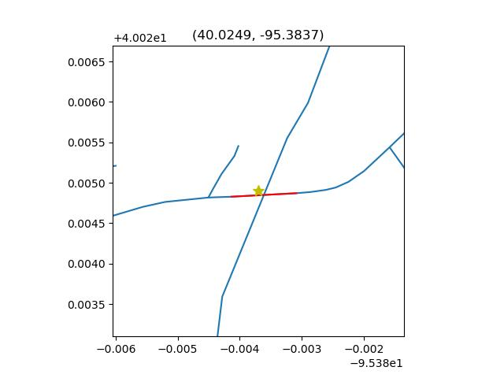
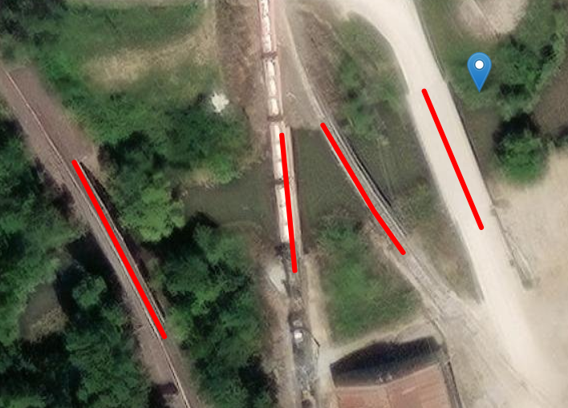
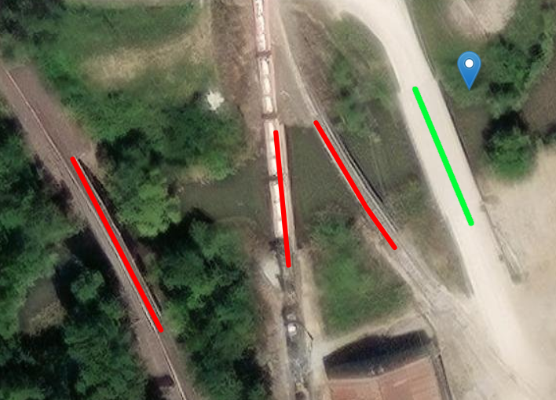

# Introduction and Motivation
With the growth in popularity of Google Maps over the last several years, many other routing alternatives and complete world maps have cropped up. One such effort is Open-Street Maps (OSM). While not widely used in the United States, OSM has seen greater use in Europe and continues to grow thanks to community efforts. Along side the growing interest of open-source geographical data is a growing interest in bridge data. Bridges are integral to our day-to-day infrastructure, so it is crucial they are maintained well and watched closely. Bridge-aware vehicle routing is a relatively unexplored area of bridge health maintenance and could play a key role in scenarios like routing multi-ton convoys. 

OSM already includes bridge data, but not nearly enough to properly perform proper bridge-aware routing. This is where the National Bridge Inventory (NBI) steps in. The NBI is a massive database containing hundreds of fields of data for thousands of bridges in the United States. However, NBI and OSM are quite different in nature. Is it possible to use these datasets together, or better yet, add NBI's data into OSM?

## Note
This blog was adapted from my Master's thesis I wrote during my Graduate Assistantship. If you'd like to read more about this project, you can find the paper <a href='/Heller-Bridge-Thesis.pdf' target='_blank'><u>here</u></a>.

# NBI vs. OSM Formats
The first hurdle in adding NBI data to OSM rears its head when we simply start looking at the two datasets. Open Street Maps is available in many formats, but is commonly found in two: OSM XML and PBF. OSM XML is the easiest format to use for OSM data. It is human-readable XML that thoroughly expresses OSM data. This format is used for data analysis. 

PBF, or Protocolbuffer Binary Format, on the other hand, is a binary format that can compress the entirety of the United States of America into a 10GB file and is blazing fast, but requires specialized tools to use. This format is used when appending the data. 

Moving to NBI, it uses standard database formats, being easily downloaded into a CSV file and modified with just about any file editor. 

To add the data, we use Python to iterate through the NBI's CSV file and add data to OSM using [PyOsmium](https://docs.osmcode.org/pyosmium/latest/), an open-source Python library built for reading and modifying OSM data.

## What is a bridge?

The second hurdle arrives when we start looking at *how* bridges are represented between the two datasets. 

In OSM, regardless of the file format, all geographical items are represented by Ways, Nodes, and Relations. Bridges specifically are represented as Ways (lines) that connect various Nodes (points). These Ways can have Tags as key-value pairs. For example, the ```"bridge"="yes"``` tag would indicate that a way is a bridge in the real world.

In NBI, all bridges are geographically represented by a single coordinate point. While this typically is located at the center of the bridge, there is no government-issued standard. In some cases, points may be over 10 meters away from the actual bridge location.

The above image shows the distinction between bridges in OSM and NBI. The NBI bridge is represented by a gold star and the corresponding OSM bridge by a red line. Though the bridges are represented geographically in different methods, once matched, adding data will be as simple as creating new OSM tags. For example, ```"nbi-sub-con"="2"``` is a valid OSM Tag that could represent the corresponding NBI entry's substructure condition rating as 2.

# Querying data
So, how do we actually match the bridges together? Obviously, the datasets are completely different, OSM has no knowledge of NBI's data points and NBI is not nearly expressive enough to easily match it to OSM. So what's the best way to make sure our NBI entries match our OSM bridges? Querying.

Overpass is an open-source Web API that allows users to query OSM data. With it we can look for OSM bridges in an area, using an NBI entry as the starting point. Additionally, we can filter out points we don't care about like most roads, rivers, and buildings, leaving us with only nearby bridges.



The above image shows the results of using Overpass's querying. Folium is used to visualize everything on real-world imagery. The blue pin on the right is the currently-analyzed NBI point, and the red lines are nearby OSM bridges collected from Overpass. We now have a selection of contending bridges for a match, but how do we know which one to pick? After all, some situations may have numerous bridges in a very small area, all with very little distinction.

# Scoring and Heuristics
The trick is to apply heuristics to our queried bridges to ensure a match is correct. Heuristics are practical problem-solving techniques that aim to create efficient solutions to complex issues with large ranges. In this project heuristics will be used to further narrow our queried selection of bridges and find a valid match. The best way to accomplish this starts by looking at the two datasets. Between NBI and OSM, we see very few datums of similar identifications. However there are a few fields that exist between the two sets that could be feasibly compared: location and name.

Location is the more straightforward of the two to compare -- theoretically. NBI defines bridges by singular points. OSM defines bridges by ways, which is a collection of lines. To calculate the distance, we use some relatively simple geometry to find the shortest distance between the NBI point and a line from the OSM bridge. This distance must be calculated for all OSM lines representing the bridge. The shortest distance we find between all of the lines is the distance between the two bridge entries.

Additionally, we can compare the names of the two items. While these often differ greatly, there are equally as many times where we can find something similar between the two. For instance, "US76" in NBI and "Highway 76" in OSM are different in text, but logically similar. Unfortunately, methods performed in this paper don't account for logical equivalence. The Sorensen-Dice coefficient is sufficient to create a good-enough similarity score between the two strings.

Once the two scores are made, we combine them and throw away scores under a certain threshold to decide which entries are and aren't valid matches.



The above image shows the results of using Queried-Heuristic matching. Near one NBI point, we find many bridges. Using heuristics, we are able to filter out poor matches and select only the best fit to add NBI data to!

# Results
This project went through multiple iterations, much of which has been excluded from this post. The data merging process was performed on the Nebraska OSM and NBI datasets to reduce computation times. Overall, the project went from a 30% successful match rate to over 65% using Query-Heuristic Matching! 

## Disclaimer
This project was began and 2022 and ended in 2023 while I was earning my Masters Degree. No further research has been carried out since.